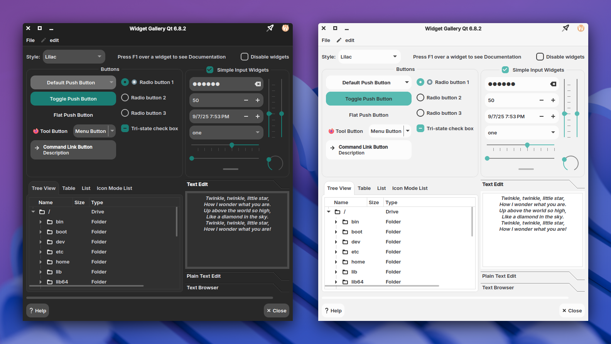

# Lilac

**Lilac**, a Qt6 theme inspired by the [Orchis GTK theme](https://github.com/vinceliuice/Orchis-theme) by [Vinceliuice](https://github.com/vinceliuice)

## About

A native Qt6 application style for KDE Plasma that provides modern widget styling without relying on Kvantum. This theme fully supports KDE color schemes, automatically adapting to your system colors.

This is strictly an application style - it handles only the appearance of Qt widgets and interface elements. It does not include icons, color schemes, or window decorations. Users are encouraged to pair it with their preferred color scheme, icon theme, window decorations…


Screenshot: Icons: _Vimix_, ColorScheme: _FluentDark/FluentLight_, Window Decorations: _Klassy_, Font: _Inter SemiBold_

## Building:

### Build Configuration

#### KStyle Integration

[KStyle](https://api.kde.org/kstyle-module.html) provides enhanced integration with KDE Plasma. If you don't use KStyle, QCommonStyle is used. KStyle is also used for styling some KDE frameworks widgets.

- **Default behavior**: `OFF` (i.e. KStyle will be used)
- **Available options**:
  - `-DNO_KSTYLE=ON`: Doesn't use KStyle

**Recommendation**: Use KStyle with KDE Plasma, otherwise probably use QCommonStyle (KStyle has a lot of dependencies)

#### KColorScheme Support

[KColorScheme](https://api.kde.org/kcolorscheme-index.html) extends QPalette functionality to provide better color consistency across KDE applications.

- **Default behavior**: `OFF` (i.e. KColorScheme will be used)
- **Available options**:
  `-DNO_KCOLORSCHEME=ON`: Disables KColorScheme support

**Note**: KColorScheme is recommended for better color consistency, but can be disabled to reduce dependencies.

#### Settings

Whether to enable settings, this requires `QDbus` and `KConfig` as dependencies.
When enabled, two additional targets will be created, a standalone settings app and a library to integrate with the KDE plasma systemsetings.

- **Default behavior**: `OFF` (i.e. Settings will be enabled)
- **Available options**:
  `-DNO_SETTINGS=ON`: Disables settings

#### KWindow System

[KWindowSystem](https://api.kde.org/kwindowsystem-index.html) is a library abstracting the window system. This style uses KWindowSystem to create a blur behind menus. Note that your system may not support this way of blurring behind windows/menus.

- **Default behavior**: `OFF` (i.e. KWindowSystem will be included)
- **Available options**:
  `-DNO_KWINDOWSYSTEM=ON`: Disables KWindowSystem

### Installation steps:

**Note:** this theme only supports **Qt >= 6.6.0**

1.  **Install dependencies**

    **All Dependencies:**

    _Build:_ `git` `cmake` `gcc-c++`

    _Run:_ <br>
    `cmake(Qt6Widgets)` `cmake(Qt6Gui)`, KStyle:&nbsp; `cmake(KF6FrameworkIntegration)`, KColorScheme:&nbsp;`cmake(KF6ColorScheme)`, Settings:&nbsp;`cmake(KF6Config)` `cmake(Qt6DBus)`, KWindowSystem:&nbsp;`cmake(KF6WindowSystem)`

    **OpenSUSE:**

    ```shell
    sudo zypper in git cmake gcc-c++ 'cmake(Qt6Widgets)' 'cmake(Qt6Gui)' 'cmake(KF6FrameworkIntegration)' 'cmake(KF6ColorScheme)' 'cmake(KF6Config)' 'cmake(Qt6DBus)' 'cmake(KF6WindowSystem)'
    ```

    **Fedora:**

    ```shell
    sudo dnf install git cmake gcc-c++ 'cmake(Qt6Widgets)' 'cmake(Qt6Gui)' 'cmake(KF6FrameworkIntegration)' 'cmake(KF6ColorScheme)' 'cmake(KF6Config)' 'cmake(Qt6DBus)' 'cmake(KF6WindowSystem)'
    ```

    **Ubuntu/Debian:**

    ```shell
    sudo apt install git cmake g++ qt6-base-dev libkf6style-dev libkf6colorscheme-dev libkf6config-dev libkf6windowsystem-dev
    ```

    **Arch:**

    ```shell
    sudo pacman -Sy git cmake gcc qt6-base frameworkintegration kcolorscheme kconfig kwindowsystem
    ```

2.  **Clone the repository**

    ```shell
    git clone https://github.com/zalesyc/lilac.git && cd lilac
    ```

3.  **Configure**

    3.1 create the build directory

    ```shell
    mkdir build && cd build
    ```

    3.2 Configure the project with cmake

    here you can add the options from the Build Configuration section

    ```shell
    cmake -DCMAKE_BUILD_TYPE=Release -DCMAKE_INSTALL_PREFIX=/usr ..
    ```

4.  **Build and Install**

    4.1 Compile

    ```shell
    cmake --build . --parallel
    ```

    4.2 Install

    ```shell
    sudo cmake --install .
    ```

The style can now be selected from system settings

> [!NOTE]
> Written in C++, the theme may contain bugs that could cause an application using it to crash. If you find such a crash, test with a different theme and please report it here.
## Issues / TODO:

- Right-to-left language support
- Mnemonics
